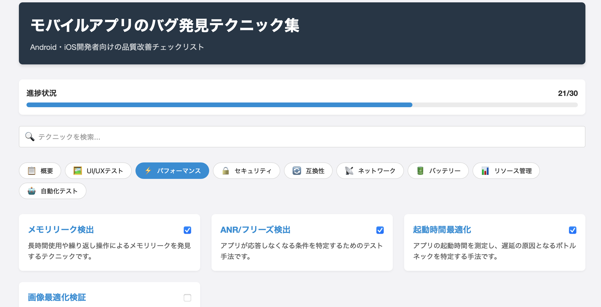

# モバイルアプリのバグ発見テクニック集

AndroidとiOSアプリの品質向上のためのバグ発見テクニックをまとめたチェックリストツールです。開発者やQAエンジニアがモバイルアプリをテストする際に役立つ、体系的なテクニック集を提供します。



## 特徴

- **進捗管理**: チェックボックスでテスト完了状況を管理し、進捗状況を可視化
- **カテゴリ別整理**: 8つのカテゴリに分類された22種類のテクニックを収録
  - UI/UXテスト
  - パフォーマンス
  - セキュリティ
  - 互換性
  - ネットワーク
  - バッテリー
  - リソース管理
  - 自動化テスト
- **キーワード検索**: 必要なテクニックをすぐに見つけられる検索機能
- **詳細解説**: 各テクニックの実施方法と確認ポイントを詳細に記載
- **オフライン対応**: インターネット接続なしで使用可能
- **レスポンシブデザイン**: モバイル端末からもアクセス可能

## 使い方

1. カテゴリタブから関連するテクニックを表示
2. 検索ボックスで特定のテクニックやキーワードを検索
3. テクニックをクリックして詳細内容を表示
4. テスト実施後はチェックボックスにチェックを入れて進捗管理

## 収録テクニック

代表的なテクニック例：

- **画面回転テスト**: 画面回転時のUIの挙動や状態保持に関するバグを発見
- **メモリリーク検出**: 長時間使用や繰り返し操作によるメモリリークを発見
- **不安定ネットワーク対応**: 低速・不安定なネットワーク環境下でのアプリ挙動をテスト
- **データ保存セキュリティ**: アプリ内の機密データの保存方法に関するセキュリティホールを発見
- **バッテリー消費分析**: アプリのバッテリー使用効率を検証し、過剰消費の原因を特定

## インストール

このアプリケーションは単一のHTMLファイルとJSONデータファイルで構成されており、追加のインストールは不要です。

1. リポジトリをクローンするか、ZIPファイルとしてダウンロードします
2. `index.html` をブラウザで開くだけで使用できます

### オンラインデモ

https://sakamoth.github.io/mobile-app-bug-finder/

## 開発環境

ローカルで開発する場合は、簡易HTTPサーバーを使用することをお勧めします：

```bash
# Pythonの場合
python -m http.server

# Node.jsの場合
npx http-server
```

## データの永続化

- テスト進捗状況はブラウザのLocalStorageに保存されます
- 異なるデバイス間でのデータ共有には、リポジトリのclone/pullを使用してください

## 貢献方法

1. このリポジトリをフォークします
2. 機能追加やバグ修正のためのブランチを作成します
3. 変更をコミットします
4. プルリクエストを送信します

バグ報告や新しいテクニック提案も歓迎します。Issueで報告してください。

## その他
本ツールはClaude 3.7 Sonnetを使用して作成されました。

## ライセンス

[MIT License](LICENSE)
